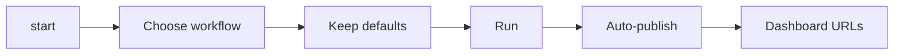

# sft-label

中文说明：[`README.zh-CN.md`](README.zh-CN.md)

`sft-label` is a dataset curation pipeline for code-generation SFT data. It can normalize raw conversations, label each assistant reply with a capability taxonomy, score training value, aggregate multi-turn conversations, filter higher-signal subsets, and generate shareable dashboards.


## What it does

`sft-label` is designed for real labeling/curation workflows instead of one-off tagging.

- **Pass 1 – labeling:** assign a 9-dimension taxonomy to each sample
- **Pass 1 extensions (optional):** add spec-driven fine-grained tags
- **Pass 2 – scoring:** estimate training value with complexity / quality / reasoning / rarity
- **Pass 2.5 – conversation aggregation:** compute conversation-level metrics for multi-turn data
- **Pass 3 – semantic clustering:** deduplicate long trajectories and keep representative windows
- **Pass 4 – filtering:** export higher-value subsets for review or training
- **Dashboards:** inspect runs in generated HTML dashboards and optionally publish them behind a static service

For the full pipeline design, see [How sft-label works](docs/guides/how-sft-label-works.md).

## Quick start

### 1. Install

```bash
uv sync --extra dev
```

Optional dataset tooling:

```bash
uv sync --extra dev --extra data
```

### 2. Configure your LLM endpoint

```bash
export LITELLM_BASE="http://localhost:4000/v1"
export LITELLM_KEY="your-key"
```

### 3. Start with the default path

```bash
uv run sft-label start
# default path:
# - choose "Pass 1 + Pass 2"
# - keep most prompts at their defaults
# - auto-publish prompt defaults to **Yes**
# - finish with dashboard URLs
```

If you want to preview the command first:

```bash
uv run sft-label start --dry-run
```

### 4. If you already know the exact command

```bash
# Repo smoke test with bundled fixture data
uv run sft-label run --input tests/fixtures/e2e_folder_test/ --score --limit 10

# Pass 1 only
uv run sft-label run --input data.json

# Pass 1 + Pass 2
uv run sft-label run --input data.json --score

# Score an existing labeled file
uv run sft-label score --input labeled.json
```

## Default path: `sft-label start`

`uv run sft-label start` is the recommended default entry point.



In the common case:

- choose **Pass 1 + Pass 2**
- keep most prompts unchanged (concurrency defaults to 200 with presets 25/50/150/200/300 plus a custom value, and the RPS max limit prompt also accepts a custom entry)
- auto-publish prompts default to **Yes**
- if no dashboard service exists yet, `start` can initialize one, start it, and print stable dashboard URLs
- pick one dashboard exposure mode once:
  - **local** → `127.0.0.1`
  - **LAN** → `0.0.0.0` for same-network access
  - **public** → `0.0.0.0` plus your reverse-proxy/public base URL

What `start` does:

1. **Lets you choose a workflow**: Pass 1 + Pass 2 is the default recommendation, followed by Pass 1 only, scoring only, semantic clustering, filtering, maintenance, export, and dashboard-service workflows.
2. **Asks only for the required inputs**: input path, optional output path, mode, prompt mode, concurrency, and a few workflow-specific options (including `--adaptive-runtime` / `--recovery-sweep` toggles when relevant).
3. **Builds the exact CLI command for you** and shows a launch summary before execution.
4. **Can finish the run with URLs** by auto-publishing dashboards to your configured service.

After the launcher captures your dashboard service/auto-publish choices and any needed exposure details, it prints a richer execution overview—command, concurrency/RPS caps, dashboard status, and auto-publish decisions—before asking whether to execute.

Two dashboard-service quality-of-life details:

- If the default dashboard service is already `running` or `starting`, `start` continues directly instead of asking for a restart.
- If you enter dashboard service maintenance from `sft-label start`, you can keep executing maintenance actions in the same session instead of exiting and re-entering the launcher.

Useful flags:

```bash
uv run sft-label start --dry-run
uv run sft-label start --lang en
uv run sft-label start --lang zh
```

A fuller walkthrough is in [Interactive launcher guide](docs/guides/interactive-launcher.md).

### Pass 1 extension diagnostics

When you turn on one or more `--label-extension` specs through the launcher, `start` prints a compact preflight block that lists every registered spec, whether it has a trigger, and the prompt/schema size warnings you should care about before the run starts. Treat that block as your first checkpoint: confirm the spec shape looks right, note any triggerless or oversized prompts, and tighten the schema before scaling up. After the run completes, a follow-up diagnostics section highlights per-spec match counts, failed/invalid issues, and unmapped rows, with pointers to `stats_labeling.json` → `extension_stats.specs` so you can trace warnings into dashboards or the `runtime_events` logs.

Extension exports stay optional: add `--include-extensions` when you run `export-review` to add extension columns to the CSV (`uv run sft-label export-review --input <run_dir> --output review.csv --include-extensions`). That mode keeps the default CSV format untouched unless you explicitly opt in, so you can let downstream reviewers see the new columns without affecting existing exports.

From `sft-label start`, you can now enter either a single YAML path, a directory path (then choose one or more YAML specs), or `examples` to browse the built-in extension examples. Keep each spec focused on a single domain/trigger so the dashboards, diagnostics, and review columns for each extension stay interpretable. For detailed workflows, examples, and the refreshed first-run checklist, see [Pass 1 extension labeling](docs/guides/pass1-extension-labeling.md).

## What a run writes

The exact layout depends on the input mode, but these are the main artifacts most users should expect.

### Standard file or directory runs

```text
<run_dir>/
  labeled.json                 # Pass 1 output (or per-file labeled outputs)
  scored.json                  # Pass 2 output when --score is enabled
  stats_labeling.json          # Pass 1 stats
  conversation_stats_labeling.json  # for single-file runs; directory runs write this beside each per-file Pass 1 stats file
  stats_scoring.json           # Pass 2 stats
  conversation_scores.json     # Multi-turn aggregates when scoring is available
  runtime_events.jsonl         # adaptive runtime events (when enabled)
  runtime_summary.json         # adaptive runtime summary (when enabled)
  dashboards/
    dashboard_labeling.html
    dashboard_labeling.data/
    dashboard_scoring.html
    dashboard_scoring.data/
    _dashboard_static/v1/
```

### Mirrored inline JSONL runs

```text
<run_root>/
  <dataset_root>/              # mirrored dataset tree with embedded data_label
  meta_label_data/
    checkpoint.json
    summary_stats_labeling.json
    summary_stats_scoring.json
    conversation_scores.json
    files/.../conversation_stats_labeling.json  # per-file lightweight Pass 1 conversation aggregate
    dashboards/
      dashboard_labeling*.html
      dashboard_scoring*.html
```

For a deeper explanation of each artifact, see [Output files and dashboards](docs/guides/output-files-and-dashboards.md).

`conversation_stats_labeling.json` is intentionally small: the labeling dashboard tree can reuse it instead of reopening large per-file `labeled.jsonl` artifacts, which helps keep memory bounded on very large runs.

## Viewing dashboards

### Open generated HTML locally

After a run, open the generated dashboard HTML files in your browser.

Typical locations:

- standard runs: `dashboards/dashboard_labeling.html`, `dashboards/dashboard_scoring.html`
- mirrored inline runs: `meta_label_data/dashboards/dashboard_labeling*.html`, `meta_label_data/dashboards/dashboard_scoring*.html`

If you edit outputs or rebuild stats later:

```bash
uv run sft-label recompute-stats --input <run_dir>
uv run sft-label regenerate-dashboard --input <run_dir>
```

### Publish dashboards behind a static service

`sft-label` also supports long-lived dashboard hosting.

```bash
# initialize a local static service
uv run sft-label dashboard-service init --web-root ~/sft-label-dashboard --service-type builtin

# start the service
uv run sft-label dashboard-service start

# publish an existing run
uv run sft-label dashboard-service register-run --run-dir <run_dir>
```

That command prints stable URLs like `http://127.0.0.1:8765/runs/<run-id>/dashboard_labeling.html`.

If `dashboard-service start`, `dashboard-service restart`, or the interactive launcher finds that the configured port is already occupied, it now prints the owning PID/command and lets interactive users choose a replacement port instead of failing immediately. Simple direct `http://host:port` share URLs are updated to the new port automatically; custom reverse-proxy URLs are left unchanged.

For production-style hosting, there is also a PM2-backed service mode. See [Output files and dashboards](docs/guides/output-files-and-dashboards.md).

## Recommended practices for extension labeling

If you want domain-specific labels on top of the core 9-dimension Pass 1 taxonomy, use **label extensions** with a `prompt + explicit schema` contract.

Recommended rollout:

1. **Start minimal** — begin with a small schema that is easy to review manually.
2. **Verify trigger quality first** — make sure only the intended samples match.
3. **Then add richer fields** — expand schema granularity only after the first version is stable.
4. **Keep multiple extensions separate** — use repeated `--label-extension` flags instead of overloading one spec.

Bundled examples:

- Minimal starter: `docs/examples/extensions/ui_fine_labels_minimal_v1.yaml`
- Richer UI example: `docs/examples/extensions/ui_fine_labels_v1.yaml`
- Web UI analysis / mix-optimization example: `docs/examples/extensions/ui_web_analysis_v1.yaml`

Typical commands:

```bash
# minimal first rollout
uv run sft-label run \
  --input data.jsonl \
  --label-extension docs/examples/extensions/ui_fine_labels_minimal_v1.yaml

# richer UI extension
uv run sft-label run \
  --input data.jsonl \
  --label-extension docs/examples/extensions/ui_fine_labels_v1.yaml

# web-only UI mix analysis
uv run sft-label run \
  --input filtered_web_ui_data.jsonl \
  --label-extension docs/examples/extensions/ui_web_analysis_v1.yaml

# multiple extensions side by side
uv run sft-label run \
  --input data.jsonl \
  --label-extension docs/examples/extensions/ui_fine_labels_minimal_v1.yaml \
  --label-extension docs/examples/extensions/ui_fine_labels_v1.yaml

# export review CSV with extension columns
uv run sft-label export-review \
  --input <run_dir> \
  --output review.csv \
  --include-extensions
```

When enabled, the review export adds per-spec status/matched metadata, spec version/hash when present, flattened label/confidence columns, and a normalized unmapped summary column for each extension.

Best practice:

- keep each extension focused on one domain,
- make field ids stable and dashboard-friendly,
- prefer enum / multi-enum fields with clear option IDs,
- review dashboard distributions before widening the schema.

### First run checklist

1.  Run one minimal spec (e.g., `docs/examples/extensions/ui_fine_labels_minimal_v1.yaml`) against a small sample and confirm the extension appears in the dashboard.
2.  Check that only the intended rows match the trigger so you can trust `matched` counts.
3.  Inspect `label_extensions.<spec_id>` payload for a few samples in the drawer to make sure the JSON is valid and fields align with the schema.
4.  Rerun `uv run sft-label export-review --include-extensions` on that subset to see the columns you plan to publish.
5.  Once the minimal spec looks stable, add richer fields or a second extension.

### Recommended spec size

- Aim for **≤ 5 fields** per extension to keep the review surface manageable.
- Keep the total number of enum options per field in the low double digits; more than ~20 options usually signals a field that should be split or simplified.
- Treat prompt text as a resource: a good prompt+schema serialization stays under ~2,000 characters, which leaves plenty of headroom under the compact budget.
- If a prompt is longer than that, shorten the instructions, trim examples, or split the logic into multiple specs.

### Compact-mode guidance

1.  The compact conversation budget is 8,000 characters; we do not enforce it, but a single extension’s prompt+schema should stay under ~2,000 characters to avoid hitting payload limits.
2.  After you enable compact mode, print the current prompt length, schema summary, and the soft recommendation above before the run so you can adjust if anything looks bloated.
3.  Long prompts or large schemas should be handled by either trimming prose, limiting options, or moving parts of the classification to a separate extension.

### Validation checklist

Before trusting the extension results, confirm:
- Trigger hit rate matches expectations (compare `matched` vs. `skipped` in `stats_labeling.json`).
- Per-field distributions show the values you expect instead of a single dominant option.
- Low-confidence values and unmapped entries stay within acceptable bounds for your domain.
- The dashboard drill-down returns the samples you care about so you can spot-check 10–20 rows manually.
- Exported review CSV columns include the extension fields so downstream reviewers can read the labels.

### When to split into multiple extensions

- The domain shifts (e.g., mobile vs. web vs. infra) or the prompt logic has distinct responsibilities.
- One spec would otherwise contain more than ~5 fields, >20 options per field, or a prompt that would exceed the recommended prompt+schema length.
- You want different trigger rules or sampling strategies per extension so you can enable/disable them independently.
- You need to measure adoption per schema; separate specs keep stats isolated.

### Web UI dataset analysis guidance

“UI SFT data” refers to the subset of your dataset that explicitly targets Web / desktop browser UI surfaces (dashboards, landing pages, data explorers, builders, admin consoles, component work, and interactive panels). The new Web-only analysis example (`docs/examples/extensions/ui_web_analysis_v1.yaml`) adds labels that surface:

- **Surface coverage** (`ui_surface_type`) so you can see whether the dataset is stuck in one UI family.
- **Interaction mix** (`interaction_pattern`) so you can detect overconcentration in CRUD/forms versus search/explore or builder/editing work.
- **State/data complexity** (`state_data_complexity`) so thin local-state samples do not crowd out remote-data or multi-source coordination cases.
- **Engineering constraints** (`ui_constraint_focus`) so design-system, responsive, accessibility, dense-data, and performance-sensitive work remain visible during curation.
- **Ecosystem shape** (`frontend_stack_shape`) so framework skew is visible when rebalancing the subset.

Use this example on targeted subsets when you are optimizing dataset mix—run it over filtered Web-only data rather than enabling it blindly across the full input. Each enabled extension adds an extra extension-labeling call for every sample it touches, so **do not turn on domain-personalized or mobile-specific extensions over your entire dataset** unless you have trimmed the inputs first. Mobile surfaces belong in their own extension: the prompts, triggers, signals, and responsiveness choices are different, and mixing them would dilute the Web-focused analysis while inflating per-sample costs.

This example intentionally keeps only `domain_any_of` active. The other trigger keys remain in the YAML with empty constraints so users can see the available routing dimensions without narrowing recall by default. If you later make those trigger lists non-empty, that means you are deliberately trusting core Pass 1 precision enough to use language / intent / task / context / difficulty as hard extension-routing gates.

If you want to clone this example into your own extension, the short recipe lives in [Pass 1 extension labeling](docs/guides/pass1-extension-labeling.md) under “How to turn this example into your own extension”.

## Common next steps

```bash
# filter scored data
uv run sft-label filter --input <run_dir> --value-min 7 --format training

# recompute stats offline after manual edits
uv run sft-label recompute-stats --input <run_dir>

# regenerate dashboards from existing stats/data
uv run sft-label regenerate-dashboard --input <run_dir>

# validate taxonomy definitions
uv run sft-label validate
```

More copy-paste recipes: [Common workflows](docs/guides/common-workflows.md).

## Documentation map

- [Getting started](docs/guides/getting-started.md)
- [How sft-label works](docs/guides/how-sft-label-works.md)
- [Pass 1 extension labeling](docs/guides/pass1-extension-labeling.md)
- [Interactive launcher guide](docs/guides/interactive-launcher.md)
- [Adaptive LLM runtime](docs/guides/adaptive-llm-runtime.md)
- [Output files and dashboards](docs/guides/output-files-and-dashboards.md)
- [Common workflows](docs/guides/common-workflows.md)

## Development checks

```bash
uv run pytest
uv run sft-label validate
```

## License

Apache-2.0
