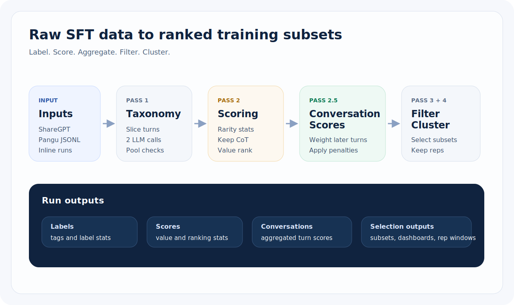
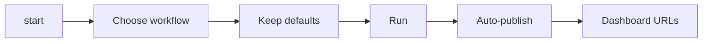

# sft-label

中文说明：[`README.zh-CN.md`](README.zh-CN.md)

`sft-label` is a dataset curation pipeline for code-generation SFT data. It can normalize raw conversations, label each assistant reply with a capability taxonomy, score training value, aggregate multi-turn conversations, filter higher-signal subsets, and generate shareable dashboards.



## What it does

`sft-label` is designed for real labeling/curation workflows instead of one-off tagging.

- **Pass 1 – labeling:** assign a 9-dimension taxonomy to each sample
- **Pass 2 – scoring:** estimate training value with complexity / quality / reasoning / rarity
- **Pass 2.5 – conversation aggregation:** compute conversation-level metrics for multi-turn data
- **Pass 3 – semantic clustering:** deduplicate long trajectories and keep representative windows
- **Pass 4 – filtering:** export higher-value subsets for review or training
- **Dashboards:** inspect runs in generated HTML dashboards and optionally publish them behind a static service

For the full pipeline design, see [How sft-label works](docs/guides/how-sft-label-works.md).

## Quick start

### 1. Install

```bash
uv sync --extra dev
```

Optional dataset tooling:

```bash
uv sync --extra dev --extra data
```

### 2. Configure your LLM endpoint

```bash
export LITELLM_BASE="http://localhost:4000/v1"
export LITELLM_KEY="your-key"
```

### 3. Start with the default path

```bash
uv run sft-label start
# default path:
# - choose "Pass 1 + Pass 2"
# - keep most prompts at their defaults
# - enable auto-publish when asked
# - finish with dashboard URLs
```

If you want to preview the command first:

```bash
uv run sft-label start --dry-run
```

### 4. If you already know the exact command

```bash
# Repo smoke test with bundled fixture data
uv run sft-label run --input tests/fixtures/e2e_folder_test/ --score --limit 10

# Pass 1 only
uv run sft-label run --input data.json

# Pass 1 + Pass 2
uv run sft-label run --input data.json --score

# Score an existing labeled file
uv run sft-label score --input labeled.json
```

## Default path: `sft-label start`

`uv run sft-label start` is the recommended default entry point.



In the common case:

- choose **Pass 1 + Pass 2**
- keep most prompts unchanged
- answer **yes** to auto-publish
- if no dashboard service exists yet, `start` can initialize one, start it, and print stable dashboard URLs
- pick one dashboard exposure mode once:
  - **local** → `127.0.0.1`
  - **LAN** → `0.0.0.0` for same-network access
  - **public** → `0.0.0.0` plus your reverse-proxy/public base URL

What `start` does:

1. **Lets you choose a workflow**: Pass 1 + Pass 2 is the default recommendation, followed by Pass 1 only, scoring only, semantic clustering, filtering, maintenance, export, and dashboard-service workflows.
2. **Asks only for the required inputs**: input path, optional output path, mode, prompt mode, concurrency, and a few workflow-specific options.
3. **Builds the exact CLI command for you** and shows a launch summary before execution.
4. **Can finish the run with URLs** by auto-publishing dashboards to your configured service.

Two dashboard-service quality-of-life details:

- If the default dashboard service is already `running` or `starting`, `start` continues directly instead of asking for a restart.
- If you enter dashboard service maintenance from `sft-label start`, you can keep executing maintenance actions in the same session instead of exiting and re-entering the launcher.

Useful flags:

```bash
uv run sft-label start --dry-run
uv run sft-label start --lang en
uv run sft-label start --lang zh
```

A fuller walkthrough is in [Interactive launcher guide](docs/guides/interactive-launcher.md).

## What a run writes

The exact layout depends on the input mode, but these are the main artifacts most users should expect.

### Standard file or directory runs

```text
<run_dir>/
  labeled.json                 # Pass 1 output (or per-file labeled outputs)
  scored.json                  # Pass 2 output when --score is enabled
  stats_labeling.json          # Pass 1 stats
  stats_scoring.json           # Pass 2 stats
  conversation_scores.json     # Multi-turn aggregates when scoring is available
  dashboards/
    dashboard_labeling.html
    dashboard_labeling.data/
    dashboard_scoring.html
    dashboard_scoring.data/
    _dashboard_static/v1/
```

### Mirrored inline JSONL runs

```text
<run_root>/
  <dataset_root>/              # mirrored dataset tree with embedded data_label
  meta_label_data/
    checkpoint.json
    summary_stats_labeling.json
    summary_stats_scoring.json
    conversation_scores.json
    dashboards/
      dashboard_labeling*.html
      dashboard_scoring*.html
```

For a deeper explanation of each artifact, see [Output files and dashboards](docs/guides/output-files-and-dashboards.md).

## Viewing dashboards

### Open generated HTML locally

After a run, open the generated dashboard HTML files in your browser.

Typical locations:

- standard runs: `dashboards/dashboard_labeling.html`, `dashboards/dashboard_scoring.html`
- mirrored inline runs: `meta_label_data/dashboards/dashboard_labeling*.html`, `meta_label_data/dashboards/dashboard_scoring*.html`

If you edit outputs or rebuild stats later:

```bash
uv run sft-label regenerate-dashboard --input <run_dir>
```

### Publish dashboards behind a static service

`sft-label` also supports long-lived dashboard hosting.

```bash
# initialize a local static service
uv run sft-label dashboard-service init --web-root ~/sft-label-dashboard --service-type builtin

# start the service
uv run sft-label dashboard-service start

# publish an existing run
uv run sft-label dashboard-service register-run --run-dir <run_dir>
```

That command prints stable URLs like `http://127.0.0.1:8765/runs/<run-id>/dashboard_labeling.html`.

For production-style hosting, there is also a PM2-backed service mode. See [Output files and dashboards](docs/guides/output-files-and-dashboards.md).

## Common next steps

```bash
# filter scored data
uv run sft-label filter --input <run_dir> --value-min 7 --format training

# recompute stats offline after manual edits
uv run sft-label recompute-stats --input <run_dir>

# regenerate dashboards from existing stats/data
uv run sft-label regenerate-dashboard --input <run_dir>

# validate taxonomy definitions
uv run sft-label validate
```

More copy-paste recipes: [Common workflows](docs/guides/common-workflows.md).

## Documentation map

- [Getting started](docs/guides/getting-started.md)
- [How sft-label works](docs/guides/how-sft-label-works.md)
- [Interactive launcher guide](docs/guides/interactive-launcher.md)
- [Output files and dashboards](docs/guides/output-files-and-dashboards.md)
- [Common workflows](docs/guides/common-workflows.md)

## Development checks

```bash
uv run pytest
uv run sft-label validate
```

## License

Apache-2.0
