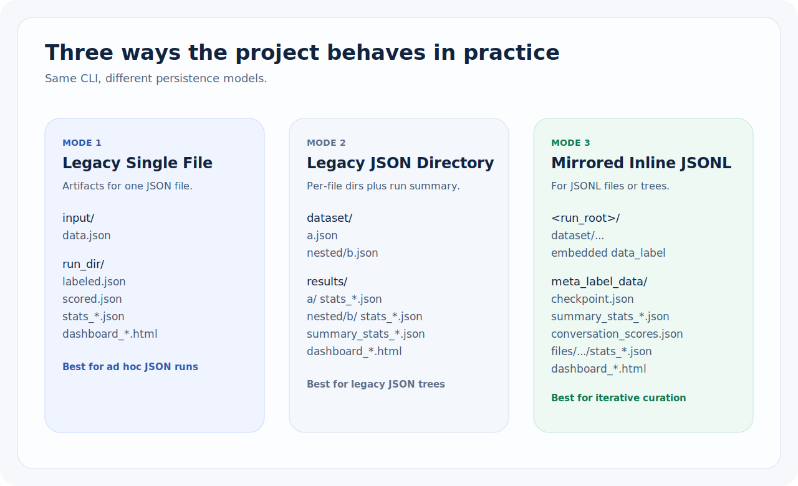
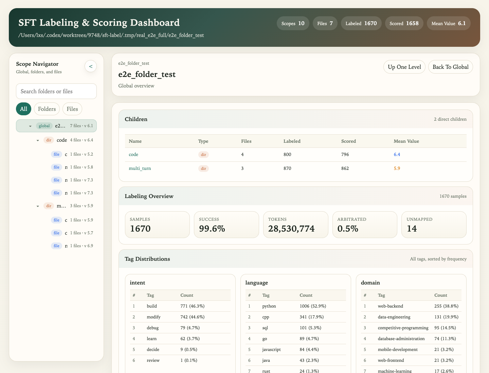

# sft-label

[](https://deepwiki.com/liuxsh9/sft-label)

SFT Capability Taxonomy and Auto-Labeling Pipeline for code-generation corpora.

`sft-label` is a curation pipeline, not just a tagger. It takes raw or previously labeled SFT data, normalizes it into per-reply samples, assigns a 9-dimension taxonomy (225 tags), scores training value, aggregates multi-turn conversations, filters high-signal subsets, and can cluster long agent trajectories to keep representative windows.

It is designed for real dataset operations:
- preserve source-row provenance instead of only producing detached artifacts
- support mirrored inline JSONL runs where labels live inside the original rows
- recompute downstream stats, rarity, and dashboards offline after manual edits or migration
- treat multi-turn conversations and long tool-using trajectories as first-class data shapes


## What You Give It And What You Get Back

| Input shape | What `sft-label` does | Primary outputs |
|------------|------------------------|-----------------|
| ShareGPT JSON / labeled JSON | Normalize, slice, label, score, filter | `labeled.json`, `scored.json`, stats, dashboards |
| Dataset directories | Process files recursively and keep per-file plus run-level summaries | per-file artifacts, summary stats, global dashboards |
| Pangu JSONL / mirrored inline runs | Preserve row order and embed annotations under `extra_info.unique_info.data_label` | mirrored dataset tree, `meta_label_data/`, dashboards |
| Long agent trajectories | Segment into windows, cluster semantically, export representatives | clustering artifacts and representative windows |

## Pipeline At A Glance

| Stage | Purpose | Core behavior |
|------|---------|---------------|
| Pass 1: Tag Labeling | Describe what capability a sample exercises | 2 LLM calls, validation against taxonomy pools, optional arbitration |
| Pass 2: Value Scoring | Estimate usefulness for training-set selection | rarity from tag stats, CoT-preserving truncation, multi-axis scoring |
| Pass 2.5: Conversation Aggregation | Treat a multi-turn dialog as one unit | later-turn weighting, inherited confidence penalty, quality-floor penalties |
| Pass 3: Filtering | Produce subsets for review or training | sample-level, conversation-level, and turn-level criteria |
| Pass 4: Semantic Clustering | Deduplicate long trajectories by behavior | pinned-prefix windowing, SemHash, ANN refinement, SNR representative pick |



## Operating Modes

1. **Single-file mode**: write conventional `labeled.json` / `scored.json` style outputs plus canonical stats and dashboards.
2. **Directory mode**: walk a tree of files, keep per-file artifacts, and emit run-level summaries and dashboards.
3. **Mirrored inline JSONL mode**: keep the original JSONL rows as the source of truth, store annotations under `data_label`, and place rebuildable caches under `meta_label_data/`.
4. **Offline maintenance mode**: rebuild stats, refresh rarity, and regenerate dashboards without calling the LLM again.

## Install

```bash
# Recommended
uv sync --extra dev

# Optional: dataset tooling used by scripts/download_hf_dataset.py and scripts/sample_to_sft.py
uv sync --extra dev --extra data

# Alternative editable install
pip install -e .
```

## Quick Start

```bash
# Set LLM endpoint
export LITELLM_BASE="http://localhost:4000/v1"
export LITELLM_KEY="your-key"

# Recommended when you are not sure which flags you need
uv run sft-label start

# Preview generated command without executing
uv run sft-label start --dry-run

# Pass 1 + Pass 2 in one go
uv run sft-label run --input data.json --score

# Pass 2: Value scoring (standalone, on pre-labeled data)
uv run sft-label score --input labeled.json --tag-stats stats_labeling.json

# Filter a training subset
uv run sft-label filter --input run_dir/ --value-min 7 --format training

# Cluster long trajectories and export representatives
uv run sft-label semantic-cluster --input run_dir/
uv run sft-label export-semantic --input run_dir/ --output representatives.jsonl
```

If your environment variables are only initialized in shell startup files, run one-off commands through an interactive shell, for example:

```bash
zsh -ic 'cd /path/to/sft-label && uv run sft-label start'
```

## Usage

### CLI

```bash
# Interactive launcher (recommended when unsure about flags)
sft-label start
```

The interactive launcher groups commands by workflow:
- Pipeline: Pass 1/2/4 combinations, standalone scoring, standalone semantic clustering
- Data curation: filtering
- Maintenance: stats recompute, dashboard regeneration, taxonomy validation
- Export: semantic rows, review CSV/TSV

For `run`, the launcher now also exposes inline JSONL modes directly:
- `refresh`: recompute and replace the whole embedded `data_label`
- `incremental`: skip rows whose embedded labels already satisfy the active version
- `migrate`: copy `data_label` from another inline-labeled run by `data_id`, then fill unmatched/incomplete rows
- `recompute`: rebuild stats, rarity, conversation aggregates, and dashboards without LLM calls

It also supports advanced tuning via optional raw flags input, so all existing CLI flags remain available.

```bash
# Run labeling pipeline (Pass 1)
sft-label run --input data.json

# Run on a directory
sft-label run --input data_dir/ --output results/

# Inline JSONL: incremental fill-in on an already labeled mirrored run
sft-label run --input previous_run/ --mode incremental

# Inline JSONL: migrate labels from another run, then fill gaps
sft-label run --input data_dir/ --mode migrate --migrate-from old_run/

# Inline JSONL: offline recompute from embedded data_label only
sft-label run --input previous_run/ --mode recompute

# Resume interrupted run
sft-label run --input data_dir/ --resume data_dir-labeled-20250101_120000/

# Continuous mode: Pass 1 + Pass 2 value scoring
sft-label run --input data.json --score

# Continuous mode: Pass 1 + Pass 2 + trajectory semantic clustering
sft-label run --input data.json --score --semantic-cluster

# Compact prompt mode (reduced payload size for size-limited endpoints)
sft-label run --input data.json --score --prompt-mode compact

# Continuous mode with external rarity stats
sft-label run --input data.json --score --tag-stats global_stats.json

# Standalone value scoring (Pass 2)
sft-label score --input labeled.json
sft-label score --input labeled.json --tag-stats global_stats.json
sft-label score --input results_dir/

# Standalone trajectory semantic clustering (Pass 4)
sft-label semantic-cluster --input run_dir/
sft-label semantic-cluster --input run_dir/ --output semantic_out/
sft-label semantic-cluster --input run_dir/ --resume

# Tune clustering parameters (CPU-first local embedding backend)
sft-label semantic-cluster --input run_dir/ \
  --semantic-embedding-provider local \
  --semantic-window-size 50 \
  --semantic-window-stride 30 \
  --semantic-semhash-bits 256 \
  --semantic-semhash-bands 8 \
  --semantic-hamming-radius 64 \
  --semantic-ann-top-k 32 \
  --semantic-ann-sim-threshold 0.82

# API embedding fallback (OpenAI-compatible /v1/embeddings)
sft-label semantic-cluster --input run_dir/ --semantic-embedding-provider api

# Export representative windows (default: representatives only)
sft-label export-semantic --input run_dir/ --output representatives.jsonl

# Export all windows (including non-representatives)
sft-label export-semantic --input run_dir/ --output all_windows.jsonl --include-all

# Filter high-value samples from scored data
sft-label filter --input scored.json --value-min 6.0
sft-label filter --input scored.json --value-min 6 --difficulty advanced,expert
sft-label filter --input scored.json --selection-min 7.0 --exclude-inherited
sft-label filter --input run_dir/ --value-min 7 --format training
sft-label filter --input scored.json --value-min 6 --thinking-mode slow

# Filter by conversation-level metrics (multi-turn)
sft-label filter --input scored.json --conv-value-min 7
sft-label filter --input run_dir/ --conv-value-min 6 --conv-selection-min 5
sft-label filter --input scored.json --observed-turn-ratio-min 0.5 --rarity-confidence-min 0.6
sft-label filter --input scored.json --turn-value-min 5 --turn-count-min 3

# Validate taxonomy
sft-label validate

# Export to review CSV
sft-label export-review --input labeled.json --output review.csv
```

### Inline JSONL Workflow

For Pangu-style JSONL input, the primary output is now a mirrored dataset tree instead of `labeled.json[l]` as the source of truth.

Each output row keeps the original line order and row count, and writes annotations under:

```json
{
  "extra_info": {
    "unique_info": {
      "data_id": "sha256:v1:...",
      "data_label": {
        "meta": {
          "schema_version": "1",
          "label_version": "inline-v1",
          "mode": "refresh"
        },
        "turns": [
          {
            "turn_index": 1,
            "labels": {...},
            "value": {...}
          }
        ],
        "conversation": {...}
      }
    }
  }
}
```

Typical mirrored run layout:

```text
<run_root>/
  <input_name>/...              # mirrored dataset tree
  meta_label_data/
    checkpoint.json
    summary_stats_labeling.json
    summary_stats_scoring.json
    conversation_scores.json
    files/...                   # per-file caches, logs, stats
  dashboard_*.html
```

Recommended commands:

```bash
# Full refresh labeling on raw JSONL input
uv run sft-label run --input tests/fixtures/e2e_folder_test/

# Incremental fill-in from an existing mirrored run
uv run sft-label run --input previous_run/ --mode incremental

# Migrate labels by data_id from another run, then fill missing rows
uv run sft-label run --input new_dataset/ --mode migrate --migrate-from old_run/

# Rebuild stats / rarity / dashboards from embedded data_label only
uv run sft-label run --input previous_run/ --mode recompute
```

Mode semantics:
- `refresh`: refreshes the whole `data_label` for the targeted Pass 1 stage and drops stale Pass 2 fields when labels changed
- `incremental`: preserves existing compatible labels and only calls LLM for missing/incomplete turns
- `migrate`: seeds rows from a source run matched by `data_id`, records migration provenance, then behaves like incremental fill-in
- `recompute`: no LLM calls; rebuilds derived artifacts under `meta_label_data/`

Notes:
- Full runs preserve the mirrored JSONL tree's original row count and row order. Each row is updated in place with `extra_info.unique_info.data_id` and `data_label`.
- `--limit` is a smoke/sampling mode. When enabled, the mirrored output contains only the sampled subset, so line-count parity applies to the sampled subset rather than the full source file.

### Library

```python
import asyncio
from sft_label import run, PipelineConfig

config = PipelineConfig(
    labeling_model="gpt-4o-mini",
    scoring_model="gpt-4o-mini",
    concurrency=50,
    litellm_base="http://localhost:4000/v1",
    litellm_key="your-key",
    prompt_mode="compact",  # or "full" (default)
)

stats = asyncio.run(run("data.json", config=config))
print(f"Labeled {stats['success']}/{stats['total_samples']} samples")
```

```python
# Standalone value scoring
from sft_label.scoring import run_scoring

config = PipelineConfig(
    scoring_model="gpt-4o-mini",
    scoring_concurrency=50,
)

stats = asyncio.run(run_scoring(
    input_path="labeled.json",
    tag_stats_path="stats_labeling.json",
    config=config,
))
```

## Architecture

```
Input (ShareGPT JSON / Pangu JSONL)
  │
  ├─ Pass 1: Tag Labeling
  │   ├─ Format detection + normalization (preprocessing.py)
  │   ├─ Multi-turn slicing: each reply → one sample
  │   ├─ Call 1 (LLM): Intent, Language, Domain, Task, Difficulty
  │   ├─ Call 2 (LLM): Concept, Agentic, Constraint, Context
  │   ├─ Validation: tag pool check, cross-dimension consistency
  │   ├─ Arbitration (optional): re-run low-confidence dimensions
  │   └─ Output: labeled.json + stats_labeling.json + dashboard_labeling.html
  │
  ├─ Pass 2: Value Scoring (scoring.py)
  │   ├─ Rarity computation: tag IDF + combo rarity from tag distributions
  │   ├─ COT-preserving truncation: head + middle fragments + tail
  │   ├─ LLM scoring: complexity, quality, reasoning (1 call per sample)
  │   ├─ Weighted aggregation: value_score = Σ(weight × dimension)
  │   ├─ Selection score: intra-class rank + absolute quality + global rarity
  │   └─ Output: scored.json + stats_scoring.json + dashboard_scoring.html
  │
  ├─ Pass 2.5: Conversation Aggregation (conversation.py)
  │   ├─ Group multi-turn slices by source conversation
  │   ├─ Position-weighted averaging (later turns weighted higher)
  │   ├─ Quality floor + negative flag penalties
  │   └─ Output: conversation_scores.json (conv_value, conv_selection)
  │
  ├─ Pass 3: Filtering & Selection (tools/filter_value.py)
  │   ├─ Sample-level: value_min, selection_min, difficulty, thinking_mode
  │   ├─ Conversation-level: conv_value_min, conv_selection_min, peak_complexity_min
  │   ├─ Turn-level: turn_value_min, turn_count_min/max, keep_first_last
  │   ├─ Tag filtering: include_tags / exclude_tags (dim:tag format)
  │   ├─ Source control: exclude_inherited, verify_source
  │   └─ Output formats: scored (preserves metadata) or training (stripped)
  │
  └─ Pass 4: Trajectory Semantic Clustering (semantic_clustering.py)
      ├─ Long trajectory segmentation (>50 turns) with pinned task-definition prefix
      ├─ Bilingual role-aware rendering for embedding text
      ├─ Lightweight embedding backend (local CPU hash model) or API fallback
      ├─ Deterministic SemHash (seeded random hyperplanes)
      ├─ Coarse candidate retrieval (banded SemHash + hamming radius)
      ├─ ANN refinement (cosine threshold + top-k)
      ├─ Union-find cluster assembly
      └─ Representative selection by SNR (action/observation), tie-break by value_score
```

## Taxonomy (Pass 1)

9 orthogonal categories, 225 tags:

| Category   | Tags | Select |
|-----------|------|--------|
| Intent     | 6    | single |
| Difficulty | 5    | single |
| Context    | 10   | single |
| Language   | 75   | multi  |
| Domain     | 38   | multi  |
| Task       | 22   | multi  |
| Concept    | 26   | multi  |
| Agentic    | 23   | multi  |
| Constraint | 20   | multi  |

## Tag Atlas (All 225 Tags)

A compact, searchable view of every taxonomy tag id grouped by dimension.

<details>
<summary><strong>Intent</strong> (6)</summary>

`learn` `build` `debug` `review` `decide` `modify`

</details>

<details>
<summary><strong>Difficulty</strong> (5)</summary>

`beginner` `intermediate` `upper-intermediate` `advanced` `expert`

</details>

<details>
<summary><strong>Context</strong> (10)</summary>

`greenfield` `legacy-code` `module` `monorepo` `multi-file` `repository` `single-file` `single-function`
`snippet` `with-dependencies`

</details>

<details>
<summary><strong>Language</strong> (75)</summary>

`ada` `apl` `arkts` `ascendc` `assembly` `bazel` `c` `clojure`
`cmake` `cobol` `cpp` `crystal` `csharp` `css` `dart` `dockerfile`
`dotenv` `ejs` `elixir` `erb` `erlang` `fortran` `fsharp` `go`
`gradle` `groovy` `handlebars` `haskell` `hcl` `html` `ini` `java`
`javascript` `jinja` `json` `julia` `kotlin` `latex` `liquid` `lisp`
`lua` `makefile` `markdown` `matlab` `maven` `nginx-config` `nim` `objective-c`
`ocaml` `perl` `php` `powershell` `prolog` `properties` `python` `r`
`racket` `restructuredtext` `ruby` `rust` `scala` `scheme` `shell` `smalltalk`
`solidity` `sql` `swift` `toml` `typescript` `verilog` `vhdl` `vyper`
`xml` `yaml` `zig`

</details>

<details>
<summary><strong>Domain</strong> (38)</summary>

`api-development` `automation` `bioinformatics` `blockchain` `cli-tool` `cloud-computing` `compiler-development` `compliance`
`computer-vision` `cybersecurity` `data-engineering` `data-science` `database-administration` `desktop-application` `devops` `e-commerce`
`embedded-systems` `financial-technology` `game-development` `geospatial` `graphics-and-xr` `healthcare-technology` `accessibility` `internationalization`
`iot` `machine-learning` `media-processing` `mobile-development` `natural-language-processing` `network-programming` `operating-systems` `real-time-systems`
`robotics` `scientific-computing` `search-engineering` `systems-programming` `web-backend` `web-frontend`

</details>

<details>
<summary><strong>Task</strong> (22)</summary>

`api-design` `bug-fixing` `code-completion` `code-exploration` `code-explanation` `code-optimization` `code-refactoring` `code-review-task`
`code-translation` `configuration` `dependency-management` `deployment` `documentation` `error-handling-task` `feature-implementation` `logging`
`migration` `monitoring` `performance-analysis` `schema-design` `security-audit` `testing-task`

</details>

<details>
<summary><strong>Concept</strong> (26)</summary>

`control-flow` `data-types` `functions` `data-structures` `object-oriented-programming` `functional-programming` `recursion` `concurrency`
`memory-management` `ownership` `type-system` `error-handling` `metaprogramming` `algorithms` `iterators` `design-patterns`
`architecture` `testing` `security` `database-concepts` `api-protocols` `caching` `version-control` `ci-cd`
`profiling` `debugging`

</details>

<details>
<summary><strong>Agentic</strong> (23)</summary>

`api-calling` `bash-execution` `build-execution` `code-execution` `database-query` `dependency-installation` `file-operations` `git-operations`
`static-analysis` `test-running` `ui-automation` `web-search` `context-management` `error-recovery` `iterative-refinement` `multi-file-coordination`
`multi-step-reasoning` `parallel-execution` `planning` `subagent-management` `tool-selection` `user-interaction` `visual-understanding`

</details>

<details>
<summary><strong>Constraint</strong> (20)</summary>

`accessible` `backward-compatible` `deterministic` `fault-tolerant` `gdpr-compliant` `hipaa-compliant` `idempotent` `internationalized`
`lock-free` `no-dynamic-allocation` `no-external-dependencies` `no-recursion` `observable` `pci-dss-compliant` `performance-optimized` `portable`
`scalable` `stateless` `thread-safe` `type-safe`

</details>

## Value Scoring (Pass 2)

Each sample receives multi-dimensional scores (1-10):

| Dimension   | Sub-scores | Weight |
|------------|-----------|--------|
| Complexity  | instruction, reasoning, implementation | 0.25 |
| Quality     | correctness, code_quality, explanation, completeness | 0.40 |
| Reasoning   | clarity, consistency, self_correction | 0.20 |
| Rarity      | tag IDF, combo rarity (computed, no LLM) | 0.15 |

Additional outputs per sample:
- `selection_score`: Weighted fusion of intra-class percentile rank (0.55), absolute quality (0.20), and global rarity (0.25)
- `flags`: Qualitative markers (e.g., `has-bug`, `excellent-explanation`, `clean-code`)
- `thinking_mode`: Auto-detected `slow` (explicit COT) or `fast` (inline reasoning)
- `confidence`: Model confidence in its assessment (0-1)

### Output Files (Per File)

| File | Contents |
|------|----------|
| `scored.json` | Labeled samples with `value` field added |
| `conversation_scores.json` | Conversation-level aggregated metrics (multi-turn) |
| `stats_scoring.json` | Aggregate statistics, score distributions, cross-analysis |
| `dashboard_scoring.html` | Self-contained interactive dashboard |
| `monitor_value.jsonl` | Per-sample LLM call metadata |
| `failed_value.jsonl` | Samples that failed scoring |

Example scoring dashboard from a real e2e run:



## Trajectory Semantic Clustering (Pass 4)

### What It Does

- Segments long trajectories into logically complete sliding windows.
- Preserves a pinned task-definition prefix for windows from long trajectories.
- Computes semantic fingerprints and clusters windows with SemHash + ANN.
- Selects one representative per cluster using:
  `snr = action_tokens / max(observation_tokens, 1)`.

### Output Files (Per Run)

| File | Contents |
|------|----------|
| `trajectory_windows.jsonl` | Windowed trajectory records with source linkage + turn ranges |
| `trajectory_embeddings.jsonl` | Normalized embedding vectors per window |
| `trajectory_semhash.jsonl` | SemHash bits + band values per window |
| `trajectory_cluster_membership.jsonl` | Cluster membership + SNR + representative flag |
| `trajectory_clusters.json` | Cluster-to-window map |
| `trajectory_representatives.jsonl` | Representative windows only |
| `semantic_cluster_stats.json` | Cluster diagnostics and throughput metrics |
| `semantic_cluster_manifest.json` | Versioned state manifest for compatibility/resume |

### Key Configs (PipelineConfig)

- `semantic_long_turn_threshold` (default `50`)
- `semantic_window_size` (default `50`)
- `semantic_window_stride` (default `30`)
- `semantic_pinned_prefix_max_turns` (default `3`)
- `semantic_embedding_provider` (`local` or `api`, default `local`)
- `semantic_embedding_model`
- `semantic_embedding_dim` (default `384`)
- `semantic_semhash_bits` (default `256`)
- `semantic_semhash_bands` (default `8`)
- `semantic_hamming_radius` (default `64`)
- `semantic_ann_top_k` (default `32`)
- `semantic_ann_sim_threshold` (default `0.82`)

### CPU Benchmark

```bash
python3 scripts/benchmark_semantic_clustering.py --samples 5000 --out /tmp/sc-bench
```

See [benchmark_semantic_clustering_report.md](scripts/benchmark_semantic_clustering_report.md) for projection assumptions.

### Dashboard Sections

- Value Overview Cards (mean scores, top 10%, token usage)
- Score Distributions (histograms for all dimensions)
- Sub-score Breakdown (per-dimension detail)
- Value x Tag Cross-Analysis (quality by difficulty, value by domain, etc.)
- Thinking Mode Analysis (slow vs fast comparison)
- Flag Analysis (frequency and value impact)
- Coverage Impact Analysis (tag retention at different thresholds)
- Conversation Aggregation (conv value/selection, observed-turn coverage, rarity confidence)
- Sample Explorer presets for low coverage / low rarity-confidence conversations
- File Ranking Table (global dashboard, sortable)

## Filtering (Pass 3)

Multi-condition sample selection with AND logic between criteria, OR within tag lists:

| Criterion | Flag | Example |
|-----------|------|---------|
| Value score | `--value-min` | `--value-min 6.0` |
| Selection score | `--selection-min` | `--selection-min 7.0` |
| Difficulty | `--difficulty` | `--difficulty advanced,expert` |
| Thinking mode | `--thinking-mode` | `--thinking-mode slow` |
| Include tags | `--include-tags` | `--include-tags domain:security,task:debugging` |
| Exclude tags | `--exclude-tags` | `--exclude-tags concept:basic-io` |
| Exclude inherited | `--exclude-inherited` | Drops sparse-sampled inherited labels |
| Source verification | `--verify-source` | `--verify-source original.json` |
| Output format | `--format` | `scored` (default) or `training` (stripped) |
| Preserve structure | `--preserve-structure` | Directory mode: mirror folder structure + per-file format (skip empty files) |

Conversation-level criteria (multi-turn):

| Criterion | Flag | Example |
|-----------|------|---------|
| Conv value | `--conv-value-min` | `--conv-value-min 7` |
| Conv selection | `--conv-selection-min` | `--conv-selection-min 5` |
| Peak complexity | `--peak-complexity-min` | `--peak-complexity-min 6` |
| Observed turn ratio | `--observed-turn-ratio-min` | `--observed-turn-ratio-min 0.5` |
| Rarity confidence | `--rarity-confidence-min` | `--rarity-confidence-min 0.6` |
| Turn count | `--turn-count-min/max` | `--turn-count-min 3 --turn-count-max 20` |
| Turn-level pruning | `--turn-value-min` | `--turn-value-min 5` (prune low-value turns) |

## Incremental Update Workflow

### Recompute Statistics

After manually editing labels, merging runs, or changing datasets, recompute stats without re-running the LLM pipeline:

```bash
# Inline mirrored run root (recommended)
uv run sft-label recompute-stats --input run_root/
uv run sft-label refresh-rarity --input run_root/
uv run sft-label regenerate-dashboard --input run_root/

# Single file
uv run sft-label recompute-stats --input run_dir/labeled.json
uv run sft-label recompute-stats --input run_dir/scored.json --pass 2

# Entire run directory (recomputes per-file + summary stats)
uv run sft-label recompute-stats --input run_dir/
uv run sft-label recompute-stats --input run_dir/ --pass 1
uv run sft-label recompute-stats --input run_dir/ --workers 8

# Custom output directory
uv run sft-label recompute-stats --input run_dir/ --output /path/to/output/
```

Recomputed stats are marked with `"recomputed": true`. LLM token usage fields will be zero (not preserved in pipeline output).

`--workers` controls directory-mode file-level parallelism (default: `8`).

### Refresh Rarity (Offline)

Recompute Pass 2 rarity/value fields without calling LLM:

```bash
uv run sft-label refresh-rarity --input run_dir/
uv run sft-label refresh-rarity --input run_dir/ --tag-stats global_stats.json --workers 8
```

### Regenerate Dashboards

Re-generate HTML dashboards from existing stats and data files:

```bash
# Regenerate all dashboards in a run directory
uv run sft-label regenerate-dashboard --input run_dir/

# Pass 1 only, and open in browser
uv run sft-label regenerate-dashboard --input run_dir/ --pass 1 --open

# Pass 2 only
uv run sft-label regenerate-dashboard --input run_dir/ --pass 2

# Batch directory parallelism
uv run sft-label regenerate-dashboard --input run_dir/ --workers 8
```

Requires stats files to exist — run `recompute-stats` first if they are missing.

### Cross-Dataset Rarity with `--tag-stats`

Use a historical or global Pass 1 stats file as the rarity baseline when scoring new data:

```bash
# Score new data using global tag distributions for rarity
uv run sft-label score --input new_labeled.json --tag-stats global_stats.json

# Continuous mode with external rarity baseline
uv run sft-label run --input data.json --score --tag-stats /path/to/reference_stats.json
```

### Where to Find Pass 1 And Pass 2 Stats

| Mode | Pass 1 | Pass 2 |
|------|--------|--------|
| Inline mirrored run | `<run_root>/meta_label_data/summary_stats_labeling.json` | `<run_root>/meta_label_data/summary_stats_scoring.json` |
| Inline per-file | `<run_root>/meta_label_data/files/<relpath>/stats_labeling.json` | `<run_root>/meta_label_data/files/<relpath>/stats_scoring.json` |
| Single file | `<run_dir>/stats_labeling.json` (legacy alias: `stats.json`) | `<run_dir>/stats_scoring.json` (legacy alias: `stats_value.json`) |
| Directory | `<run_dir>/<subdir>/stats_labeling.json` (legacy alias: `stats.json`) | `<run_dir>/<subdir>/stats_scoring.json` (legacy alias: `stats_value.json`) |
| Directory summary | `<run_dir>/summary_stats_labeling.json` (legacy alias: `summary_stats.json`) | `<run_dir>/summary_stats_scoring.json` (legacy alias: `summary_stats_value.json`) |

### Typical Workflows

1. **Edit labels → refresh stats/dashboards:**
   ```bash
   # Edit labeled.json manually, then:
   uv run sft-label recompute-stats --input run_dir/ --pass 1
   uv run sft-label regenerate-dashboard --input run_dir/ --pass 1
   ```

2. **Merge multiple runs → build combined reference:**
   ```bash
   # Copy scored files into a single directory, then:
   uv run sft-label recompute-stats --input merged_dir/
   # Use the merged stats as rarity baseline for new scoring:
   uv run sft-label score --input new_data.json --tag-stats merged_dir/summary_stats_labeling.json
   ```

3. **Lost dashboards → regenerate:**
   ```bash
   uv run sft-label regenerate-dashboard --input run_dir/ --open
   ```

## Development

```bash
uv sync --extra dev
uv run pytest                          # all tests
uv run pytest tests/test_e2e_mock.py   # e2e tests (mocked LLM)
uv run sft-label validate              # validate taxonomy
```

## Environment Variables

- `LITELLM_BASE` — LLM proxy base URL (default: `http://localhost:4000/v1`)
- `LITELLM_KEY` — API key for the LLM proxy

## License

[Apache License 2.0](LICENSE)
