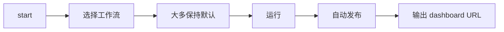

# sft-label

English version: [`README.md`](README.md)

`sft-label` 是一个面向代码生成 SFT 数据的整理与标注流水线。它可以把原始对话规范化为可处理样本，为每条 assistant 回复打上能力 taxonomy 标签，评估训练价值，聚合多轮会话，筛选高价值子集，并生成可分享的 dashboard。


## 这个项目做什么

`sft-label` 不只是“打标签工具”，而是面向真实数据整理流程的 pipeline。

- **Pass 1 – 标注**：为每个样本打 9 个维度的 taxonomy 标签
- **Pass 2 – 打分**：从 complexity / quality / reasoning / rarity 评估训练价值
- **Pass 2.5 – 会话聚合**：为多轮数据计算 conversation 级指标
- **Pass 3 – 过滤**：导出更高价值的 review / training 子集
- **Dashboards**：生成 HTML dashboard，并可发布到静态服务

完整原理请看英文详细文档：[How sft-label works](docs/guides/how-sft-label-works.md)。

## 快速开始

### 1. 安装

```bash
uv sync --extra dev
```

如果还需要数据集下载/转换脚本：

```bash
uv sync --extra dev --extra data
```

### 2. 配置 LLM 接口

```bash
export LITELLM_BASE="http://localhost:4000/v1"
export LITELLM_KEY="your-key"
```

### 3. 从默认路径开始

```bash
uv run sft-label start
# 默认路径：
# - 选择 “Pass 1 + Pass 2”
# - 大多数问题保持默认
# - 询问时开启 auto-publish
# - 结束后直接拿到 dashboard URL
```

如果你想先只看生成命令，不直接执行：

```bash
uv run sft-label start --dry-run
```

### 4. 如果你已经知道要跑什么

```bash
# 使用仓库内置数据做 smoke test
uv run sft-label run --input tests/fixtures/e2e_folder_test/ --score --limit 10

# 只跑 Pass 1
uv run sft-label run --input data.json

# Pass 1 + Pass 2
uv run sft-label run --input data.json --score

# 对已有 labeled 文件单独打分
uv run sft-label score --input labeled.json
```

## 默认路径：`sft-label start`

`uv run sft-label start` 是最推荐的默认入口。



一般情况下：

- 选择 **Pass 1 + Pass 2**
- 大多数提示保持默认
- auto-publish 回答 **yes**
- 如果还没有 dashboard service，`start` 可以直接初始化、启动并输出稳定的 dashboard URL
- 首次配置只需选一次访问方式：
  - **local** → `127.0.0.1`
  - **LAN** → `0.0.0.0`，供局域网访问
  - **public** → `0.0.0.0`，再补上反向代理 / 对外访问 URL

`start` 主要做四件事：

1. **让你选择工作流**：默认推荐 Pass 1 + Pass 2，其次还有只跑 Pass 1、只打分、语义聚类、过滤、维护、导出、dashboard service 管理等。
2. **只询问必要参数**：输入路径、可选输出路径、运行模式、prompt mode、并发等。
3. **生成准确的 CLI 命令并展示摘要**，执行前可以再确认一次。
4. **在任务结束后输出 URL**：如果开启 auto-publish，会把 dashboard 发布到已配置服务并打印访问链接。

常用参数：

```bash
uv run sft-label start --dry-run
uv run sft-label start --lang en
uv run sft-label start --lang zh
```

两个 dashboard service 细节：

- 如果默认 dashboard service 已经是 `running` 或 `starting`，`start` 会直接继续，不再要求你重启。
- 如果你从 `sft-label start` 进入 dashboard service 维护，可以在同一会话里连续执行维护操作，不用退出重进。

更详细说明见英文文档：[Interactive launcher guide](docs/guides/interactive-launcher.md)。

## 一次 run 会输出什么

具体布局取决于输入模式，但大多数用户最关心的是下面这些产物。

### 标准文件 / 目录模式

```text
<run_dir>/
  labeled.json
  scored.json
  stats_labeling.json
  stats_scoring.json
  conversation_scores.json
  dashboards/
    dashboard_labeling.html
    dashboard_labeling.data/
    dashboard_scoring.html
    dashboard_scoring.data/
    _dashboard_static/v1/
```

### 镜像 inline JSONL 模式

```text
<run_root>/
  <dataset_root>/
  meta_label_data/
    checkpoint.json
    summary_stats_labeling.json
    summary_stats_scoring.json
    conversation_scores.json
    dashboards/
      dashboard_labeling*.html
      dashboard_scoring*.html
```

更详细的文件结构解释见英文文档：[Output files and dashboards](docs/guides/output-files-and-dashboards.md)。

## 如何查看 dashboard

### 本地直接打开 HTML

跑完后，直接用浏览器打开生成的 dashboard HTML：

- 标准 run：`dashboards/dashboard_labeling.html`、`dashboards/dashboard_scoring.html`
- inline run：`meta_label_data/dashboards/dashboard_labeling*.html`、`meta_label_data/dashboards/dashboard_scoring*.html`

如果你后续修改了结果或重算了统计：

```bash
uv run sft-label regenerate-dashboard --input <run_dir>
```

### 发布到静态服务

`sft-label` 也支持把 dashboard 发布成稳定 URL：

```bash
# 初始化一个本地静态服务
uv run sft-label dashboard-service init --web-root ~/sft-label-dashboard --service-type builtin

# 启动服务
uv run sft-label dashboard-service start

# 发布已有 run
uv run sft-label dashboard-service register-run --run-dir <run_dir>
```

发布后会输出类似：`http://127.0.0.1:8765/runs/<run-id>/dashboard_labeling.html`

生产环境也支持 PM2 模式，详见英文文档：[Output files and dashboards](docs/guides/output-files-and-dashboards.md)。

## 常见后续操作

```bash
# 过滤高价值样本
uv run sft-label filter --input <run_dir> --value-min 7 --format training

# 手工修改后离线重算统计
uv run sft-label recompute-stats --input <run_dir>

# 用已有 stats/data 重建 dashboard
uv run sft-label regenerate-dashboard --input <run_dir>

# 校验 taxonomy
uv run sft-label validate
```

更多可直接复制的命令示例见英文文档：[Common workflows](docs/guides/common-workflows.md)。

## 文档导航

- [Getting started](docs/guides/getting-started.md)
- [How sft-label works](docs/guides/how-sft-label-works.md)
- [Interactive launcher guide](docs/guides/interactive-launcher.md)
- [Output files and dashboards](docs/guides/output-files-and-dashboards.md)
- [Common workflows](docs/guides/common-workflows.md)

## 开发检查

```bash
uv run pytest
uv run sft-label validate
```

## License

Apache-2.0
