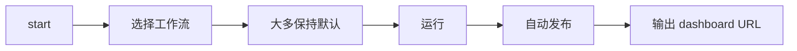

# sft-label

English version: [`README.md`](README.md)

`sft-label` 是一个面向代码生成 SFT 数据的整理与标注流水线。它可以把原始对话规范化为可处理样本，为每条 assistant 回复打上能力 taxonomy 标签，评估训练价值，聚合多轮会话，筛选高价值子集，并生成可分享的 dashboard。


## 这个项目做什么

`sft-label` 不只是“打标签工具”，而是面向真实数据整理流程的 pipeline。

- **Pass 1 – 标注**：为每个样本打 9 个维度的 taxonomy 标签
- **Pass 1 扩展（可选）**：用扩展规范补充更细粒度标签
- **Pass 2 – 打分**：从 complexity / quality / reasoning / rarity 评估训练价值
- **Pass 2.5 – 会话聚合**：为多轮数据计算 conversation 级指标
- **Pass 3 – 过滤**：导出更高价值的 review / training 子集
- **Dashboards**：生成 HTML dashboard，并可发布到静态服务

完整原理请看英文详细文档：[How sft-label works](docs/guides/how-sft-label-works.md)。

## 快速开始

### 1. 安装

```bash
uv sync --extra dev
```

如果还需要数据集下载/转换脚本：

```bash
uv sync --extra dev --extra data
```

### 2. 配置 LLM 接口

```bash
export LITELLM_BASE="http://localhost:4000/v1"
export LITELLM_KEY="your-key"
```

### 3. 从默认路径开始

```bash
uv run sft-label start
# 默认路径：
# - 选择 “Pass 1 + Pass 2”
# - 大多数问题保持默认（并发默认 200，提供 25 / 50 / 150 / 200 / 300 预设及自定义输入，RPS 最大值也支持自由填写）
# - 运行时默认采用 prompt_mode=compact + rollout_preset=compact_safe
# - auto-publish 提示默认是 **Yes**
# - 结束后直接拿到 dashboard URL
```

如果你想先只看生成命令，不直接执行：

```bash
uv run sft-label start --dry-run
```

### 4. 如果你已经知道要跑什么

```bash
# 使用仓库内置数据做 smoke test
uv run sft-label run --input tests/fixtures/e2e_folder_test/ --score --limit 10

# 只跑 Pass 1
uv run sft-label run --input data.json

# Pass 1 + Pass 2
uv run sft-label run --input data.json --score

# Pass 1 + Pass 2，并启用实验性的多轮预设
uv run sft-label run --input data.json --score --rollout-preset planner_hybrid

# Pass 1 + Pass 2，并切回回退/对照预设
uv run sft-label run --input data.json --score --rollout-preset baseline_control

# 只有在接口能承受更大请求包时，才改用 full prompt
uv run sft-label run --input data.json --score --prompt-mode full

# 对已有 labeled 文件单独打分
uv run sft-label score --input labeled.json
```

## 默认路径：`sft-label start`

`uv run sft-label start` 是最推荐的默认入口。



一般情况下：

- 选择 **Pass 1 + Pass 2**
- 大多数提示保持默认
- 运行时默认采用 **prompt_mode=compact** 与 **rollout_preset=compact_safe**
- `compact_safe` 是面向生产 / 包大小受限场景的推荐预设；`planner_hybrid` 为实验项；`baseline_control` 用于回退 / 对照
- 终端交互版 switch panel 现在会先给出 **多轮优化预设** 选择，再选择 prompt mode
- 并发默认 200，提供 25 / 50 / 150 / 200 / 300 预设及自定义输入，RPS 最大值也支持自由填写
- auto-publish 提示默认是 **Yes**
- 如果还没有 dashboard service，`start` 可以直接初始化、启动并输出稳定的 dashboard URL
- 首次配置只需选一次访问方式：
  - **local** → `127.0.0.1`
  - **LAN** → `0.0.0.0`，供局域网访问
  - **public** → `0.0.0.0`，再补上反向代理 / 对外访问 URL

完成 auto-publish/服务暴露等决策后，启动器会展示更丰富的执行概览（包括 rollout preset、并发 / RPS、dashboard 状态等），并在你确认后再执行。

`start` 主要做四件事：

1. **让你选择工作流**：默认推荐 Pass 1 + Pass 2；对于中断任务，流水线分组里也把“智能续跑”提前展示，后面再是只跑 Pass 1、只打分、语义聚类、过滤、维护、导出、dashboard service 管理等。
2. **只询问必要参数**：输入路径、可选输出路径、运行模式、多轮优化预设、prompt mode、并发等（必要时也会提示 `--adaptive-runtime` / `--recovery-sweep` 等开关）。
3. **生成准确的 CLI 命令并展示摘要**，执行前可以再确认一次。
4. **在任务结束后输出 URL**：如果开启 auto-publish，会把 dashboard 发布到已配置服务并打印访问链接。

常用参数：

```bash
uv run sft-label start --dry-run
uv run sft-label start --lang en
uv run sft-label start --lang zh
```

两个 dashboard service 细节：

- 如果默认 dashboard service 已经是 `running` 或 `starting`，`start` 会直接继续，不再要求你重启。
- 如果你从 `sft-label start` 进入 dashboard service 维护，可以在同一会话里连续执行维护操作，不用退出重进。

更详细说明见英文文档：[Interactive launcher guide](docs/guides/interactive-launcher.md)。

### Pass 1 扩展与诊断建议

在 `sft-label start` 输出的命令中，多个 `--label-extension` 规范可以同时启用；每个扩展都会单独呈现 dashboard、导出列和统计，因此建议：

- 先用一份小而稳的 spec 做小规模验证（例如 `start` 自动读取的 `extensions/ui_web_analysis_v1.example.yaml`，或你自己复制后的 YAML），确认 `matched` / `skipped` 比例合乎预期；
- 观察启动器/CLI 的**扩展预检诊断**块，那里会列出每个规范是否带 trigger、prompt/schema 长度告警，以及运行后提示的 matched、failed/invalid、unmapped 等信息；
- 诊断日志也会指向 `stats_labeling.json` 中的 `extension_stats.specs` 节，你可以直接从仪表盘或 `export-review --include-extensions` 中追查对应警告；
- 需要更多域或触发规则时，优先为每个意图写一个独立的扩展，而不是把所有字段塞进同一个 schema，这样才能保持每份诊断报告可读并降低上下游配置复杂度。

`sft-label start` 现在支持两类扩展输入方式：自动读取仓库根目录下的 `extensions/`，或手动指定单个 YAML / 一个目录（随后选择一个或多个 YAML）。`extensions/` 目录里默认带有 `ui_web_analysis_v1.example.yaml` 示例文件；你把自己的 spec 放进去并更新后，launcher 下次会自动读取最新内容。详细的扩展配置、初次运行清单和多扩展最佳实践见：[Pass 1 扩展标注指南](docs/guides/pass1-extension-labeling.md)。

如果你想先用更快的“讲解版”材料理解这个功能、读懂 example、再动手写自己的 spec，可以先看 Marp 文档：[Pass 1 extension labeling intro](docs/pass1-extension-labeling-intro.md)。

关于交互式里的“自适应运行时”：它的作用很简单——当模型服务出现压力、限速或波动时，自动放慢提交节奏、做更稳妥的退让；一般建议保持开启。

## 一次 run 会输出什么

具体布局取决于输入模式，但大多数用户最关心的是下面这些产物。

### 标准文件 / 目录模式

```text
<run_dir>/
  labeled.json
  scored.json
  stats_labeling.json
  conversation_stats_labeling.json  # 单文件 run 会直接写在这里；目录 run 会写在每个文件的 Pass 1 stats 旁边
  stats_scoring.json
  conversation_scores.json
  runtime_events.jsonl         # 自适应运行时事件（开启时）
  runtime_summary.json         # 自适应运行时摘要（开启时）
  dashboards/
    dashboard_labeling.html
    dashboard_labeling.data/
    dashboard_scoring.html
    dashboard_scoring.data/
    _dashboard_static/v1/
```

### 镜像 inline JSONL 模式

```text
<run_root>/
  <dataset_root>/
  meta_label_data/
    checkpoint.json
    summary_stats_labeling.json
    summary_stats_scoring.json
    conversation_scores.json
    files/.../conversation_stats_labeling.json  # 每个源文件的 Pass 1 轻量会话聚合
    dashboards/
      dashboard_labeling*.html
      dashboard_scoring*.html
```

更详细的文件结构解释见英文文档：[Output files and dashboards](docs/guides/output-files-and-dashboards.md)。

`conversation_stats_labeling.json` 会尽量保持很小，标注 dashboard 的树视图会优先读取它，而不是重新打开大的 `labeled.jsonl`，这样在超大规模运行时更稳。

## 如何查看 dashboard

### 本地直接打开 HTML

跑完后，直接用浏览器打开生成的 dashboard HTML：

- 标准 run：`dashboards/dashboard_labeling.html`、`dashboards/dashboard_scoring.html`
- inline run：`meta_label_data/dashboards/dashboard_labeling*.html`、`meta_label_data/dashboards/dashboard_scoring*.html`

如果你后续修改了结果或重算了统计：

```bash
uv run sft-label recompute-stats --input <run_dir>
uv run sft-label regenerate-dashboard --input <run_dir>
```

### 发布到静态服务

`sft-label` 也支持把 dashboard 发布成稳定 URL：

```bash
# 初始化一个本地静态服务
uv run sft-label dashboard-service init --web-root ~/sft-label-dashboard --service-type builtin

# 启动服务
uv run sft-label dashboard-service start

# 发布已有 run
uv run sft-label dashboard-service register-run --run-dir <run_dir>
```

发布后会输出类似：`http://127.0.0.1:8765/runs/<run-id>/dashboard_labeling.html`

如果 `dashboard-service start`、`dashboard-service restart` 或交互式启动器发现配置端口已被占用，现在会先打印占用进程的 PID/命令，并在交互场景里允许你直接输入一个新端口继续。类似 `http://host:port` 这种直接访问地址会自动同步到新端口；自定义反向代理 URL 则保持不变。

生产环境也支持 PM2 模式，详见英文文档：[Output files and dashboards](docs/guides/output-files-and-dashboards.md)。

## 扩展标注推荐实践

如果你希望在核心 9 维 Pass 1 taxonomy 之上增加领域细化标签，推荐使用 **label extension**，并采用 `prompt + 明确 schema` 的配置方式。

推荐落地顺序：

1. **先上最小版 schema**：字段少一些，便于人工抽查。
2. **先验证 trigger 命中质量**：确保只命中你真正关心的数据。
3. **稳定后再加细粒度字段**：先把第一版跑稳，再逐步丰富。
4. **多个 extension 分开维护**：通过重复 `--label-extension` 并存，不要把所有需求塞进一个 spec。

起步位置：

- `sft-label start` 默认自动读取：`extensions/ui_web_analysis_v1.example.yaml`
- CLI 直跑 / 复制参考：`docs/examples/extensions/...`

参考样例：

- 最小起步版：`docs/examples/extensions/ui_fine_labels_minimal_v1.yaml`
- 更丰富的 UI 版：`docs/examples/extensions/ui_fine_labels_v1.yaml`
- Web UI 数据分析 / 配比优化版：`docs/examples/extensions/ui_web_analysis_v1.yaml`

典型命令：

```bash
# 最小版起步
uv run sft-label run \
  --input data.jsonl \
  --label-extension docs/examples/extensions/ui_fine_labels_minimal_v1.yaml

# 更细粒度的 UI extension
uv run sft-label run \
  --input data.jsonl \
  --label-extension docs/examples/extensions/ui_fine_labels_v1.yaml

# Web-only UI 数据配比分析
uv run sft-label run \
  --input filtered_web_ui_data.jsonl \
  --label-extension docs/examples/extensions/ui_web_analysis_v1.yaml

# 多个 extension 并存
uv run sft-label run \
  --input data.jsonl \
  --label-extension docs/examples/extensions/ui_fine_labels_minimal_v1.yaml \
  --label-extension docs/examples/extensions/ui_fine_labels_v1.yaml

# 导出带 extension 列的 review CSV
uv run sft-label export-review \
  --input <run_dir> \
  --output review.csv \
  --include-extensions
```

开启后，review 导出会为每个 extension 增加 status/matched 元数据、存在时的 spec version/hash、扁平化后的 labels/confidence 列，以及归一化后的 unmapped 汇总列。

如果 Pass 2 启用了 `--extension-rarity-mode preview|bonus_only`，同一个 `export-review --include-extensions` 还可以在有值时额外填充这些扩展稀有度列：

- `extension_rarity_preview_score`
- `extension_rarity_preview_confidence`
- `extension_rarity_preview_matched_specs`
- `extension_rarity_preview_baseline_source`

说明：

- `preview` 只是诊断预览，**不会**改写原有 `rarity / value_score / selection_score`。
- `preview` 只会补充上面的 `extension_rarity_preview_*` 列。
- `bonus_only` 才会进一步新增 `rarity_v2_score`、`value_score_v2`、`selection_score_v2`；旧分数字段仍然是主语义。
- 如果扩展稀有度只能从本地回退基线计算，系统只保留诊断信息，不会给 `bonus_only` 写入非零 bonus。
- dashboard 里的这些 additive extension-rarity / V2 指标当前只在 **sample mode** 展示；conversation mode 仍保持旧语义。

实践建议：

- 一个 extension 聚焦一个领域；
- 字段 id 保持稳定、适合 dashboard 展示；
- 优先使用 enum / multi-enum 这种稳定离散字段；
- 先看 dashboard 分布，再决定是否继续加字段。

### 首次运行清单

1.  先用一份小样例跑一小批数据（例如 `extensions/ui_web_analysis_v1.example.yaml`，或你复制到自己目录下的 YAML），并确认 dashboard 里出现该 extension。
2.  核对 `matched/skipped` 数据，确认 extension 只命中期待范围。
3.  打开样本详情，把 `label_extensions.<id>` JSON 看一遍，确保字段值、confidence、unmapped 结构可读。
4.  用 `uv run sft-label export-review --include-extensions` 导出几条样本，验收列名和内容。
5.  上述都看过后再把第二个 extension 加入或扩展 schema。

### 推荐 schema 尺寸

- 每个 extension 控制在 5 个字段以内，方便人工复核。
- 单字段选项数控制在 10~20 个，超过说明字段过于细化。
- prompt + schema 序列化字符数建议在 2000 字以内，compact 模式还能有充分预算空间。
- 超出该范围时，请精简 prompt、删掉多余选项，或者把部分逻辑拆为独立 extension。

### compact 模式友好提醒

1.  compact 模式的对话预算是 8000 字符，我们不会封堵，但建议 prompt+schema 控制在 2000 字左右，留出截断和 token 发放的余地。
2.  在 launcher/CLI 里进入 compact 模式时打印当前 prompt 长度、schema 概览以及推荐值，帮助你迅速定位是否需要调整。
3.  如果提示超出推荐值，优先缩减 prompt、减少选项、下放部分功能到另一份 spec。

### 首次运行后的验证清单

- 确认 `extension_stats.specs.<id>.matched` 命中率合理。
- 每个字段的分布不是全部聚集在一个值，必要时看一看 top values。
- low-confidence 与 unmapped 数量在可接受范围之内。
- dashboard drill-down 返回的样本匹配预期，手动抽查 10~20 条。
- 导出的 review CSV 中包含 extension 字段，便于 downstream 审阅。

### 什么时候拆多个 extension

- 领域不同（比如 web vs mobile vs infra）或 prompt/trigger 本质不同。
- 一个 spec 的字段数 > 5、选项太多、提示文本太长，接近/超过建议的 2000 字。
- 需要按 trigger、启用状态或数据源来分别控制逻辑。
- 想单独观察某个 schema 的命中率、unmapped 情况或重跑效果。

### Web UI 数据集分析指南

“UI SFT 数据” 是指明确针对 Web / 桌面浏览器 UI 表面（仪表盘、登录页、数据探索、构建工具、管理控制台、组件实现等交互式界面）的样本。默认提供的 Web 专用分析起步样例（`extensions/ui_web_analysis_v1.example.yaml`，对应参考副本见 `docs/examples/extensions/ui_web_analysis_v1.yaml`）增加了如下信号，帮助你识别数据集是否被 CRUD/表单类样本过度占据，并分析分布是否均衡：

- **`ui_surface_type`**：当前样本主要属于哪类 Web UI 表面，便于发现数据是否集中在单一界面类型。
- **`interaction_pattern`**：主交互模式是展示、表单配置、搜索过滤、CRUD 密集，还是 builder / rich editing。
- **`state_data_complexity`**：状态/数据复杂度是静态、本地状态、远程数据驱动、验证密集，还是多数据源协同。
- **`ui_constraint_focus`**：是否明显涉及 design system、一致性、响应式、无障碍、dense-data 或性能敏感 UI。
- **`frontend_stack_shape`**：样本主要落在哪类 Web 前端生态，便于识别框架分布偏斜。

只在 Web-only 的子集上运行此扩展，避免直接在全量数据上启用。每启用一个扩展，每条匹配样本都会多一次扩展标注调用，因此**请务必别在整个数据集上打开领域化或移动端扩展，除非你已经先行缩小输入（例如过滤、小批量或采样）**。移动端内容应放在独立的扩展中：它们的 prompt、trigger、信号和响应式权衡不同，混在一起会让 Web 分析变得模糊，并拉高每条样本的成本。

这个示例刻意只启用 `domain_any_of`。其余 trigger key 仍然保留在 YAML 里，但约束留空，目的是让用户看见可用的路由维度，同时默认保持更高召回。如果你后续把这些列表填成非空，就意味着你愿意更严格地相信核心 Pass 1 的 language / intent / task / context / difficulty 精度，并把它们作为 extension 的硬前置条件。

可以把它理解成：

- `[]` = 这个 trigger 维度**不参与过滤**
- 非空 `*_any_of` = 这个维度变成**硬前置条件**
- 同一维度内多个值按 **OR** 匹配
- 不同 trigger 维度之间按 **AND** 组合
- 未命中时会显示为 `status=skipped`、`matched=false`

如果你想从这个案例快速克隆出自己的 extension，建议顺序是：

1. 复制 `extensions/ui_web_analysis_v1.example.yaml` 到新文件
2. 先改 `id`、`display_name`
3. 把 schema 控制在 3~5 个字段
4. 第一版只保留最宽 trigger（通常只开 `domain_any_of`）
5. 先用过滤后子集、小批量或 `--limit 20/50` 跑
6. 再看 `matched/skipped`、dashboard 和 `export-review --include-extensions`

成本/风险上，可以先用这条简单规则估算：**额外 extension 调用数 ≈ 命中样本数 × 启用的 extension 数**。宽 trigger 召回更高，但调用、时延、复核成本也更高；严 trigger 成本更低，但会增加因 Pass 1 路由误差造成的静默跳过。

如果你要从这个样例直接克隆自己的 extension，可以继续看英文指南 [Pass 1 extension labeling](docs/guides/pass1-extension-labeling.md) 里的 “How to turn this example into your own extension” 小节。

如果只想记最短版本，可以按这个顺序做：

- **必须先改**：`id`、`display_name`、`prompt`、`schema`
- **第一版通常先保留**：`output.include_confidence`、`output.allow_unmapped`
- **后面再决定要不要改严**：更多 trigger 维度、`dashboard.group`、`dashboard.priority`

## 常见后续操作

```bash
# 过滤高价值样本
uv run sft-label filter --input <run_dir> --value-min 7 --format training

# 手工修改后离线重算统计
uv run sft-label recompute-stats --input <run_dir>

# 用已有 stats/data 重建 dashboard
uv run sft-label regenerate-dashboard --input <run_dir>

# 校验 taxonomy
uv run sft-label validate
```

更多可直接复制的命令示例见英文文档：[Common workflows](docs/guides/common-workflows.md)。

## 文档导航

- [Getting started](docs/guides/getting-started.md)
- [How sft-label works](docs/guides/how-sft-label-works.md)
- [Pass 1 extension labeling](docs/guides/pass1-extension-labeling.md)
- [Interactive launcher guide](docs/guides/interactive-launcher.md)
- [Adaptive LLM runtime](docs/guides/adaptive-llm-runtime.md)
- [Output files and dashboards](docs/guides/output-files-and-dashboards.md)
- [Common workflows](docs/guides/common-workflows.md)

## 开发检查

```bash
uv run pytest
uv run sft-label validate
```

## License

Apache-2.0
